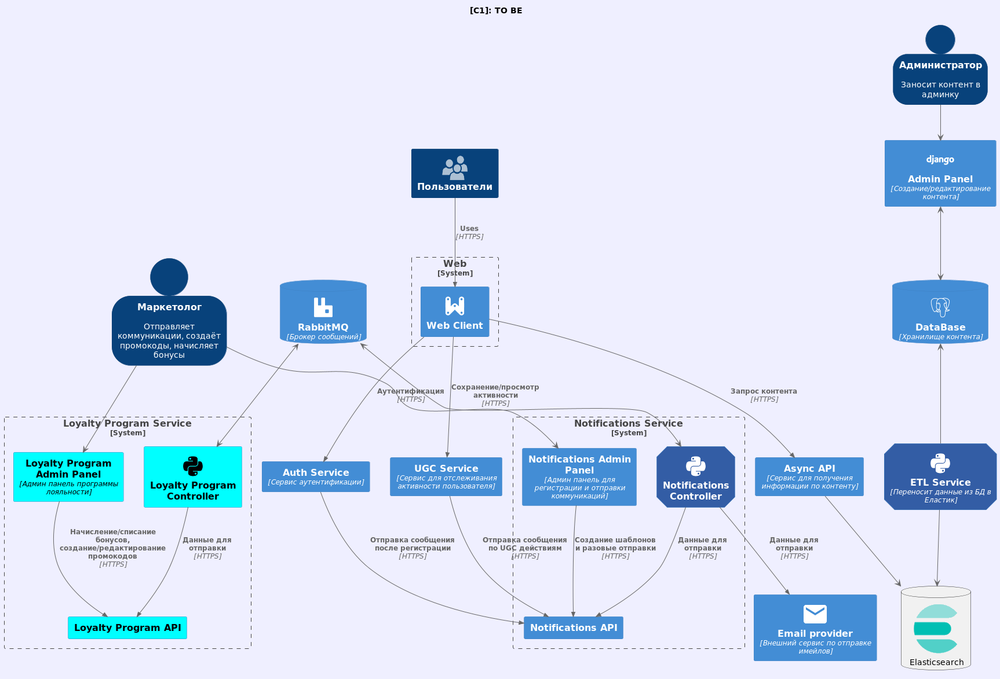
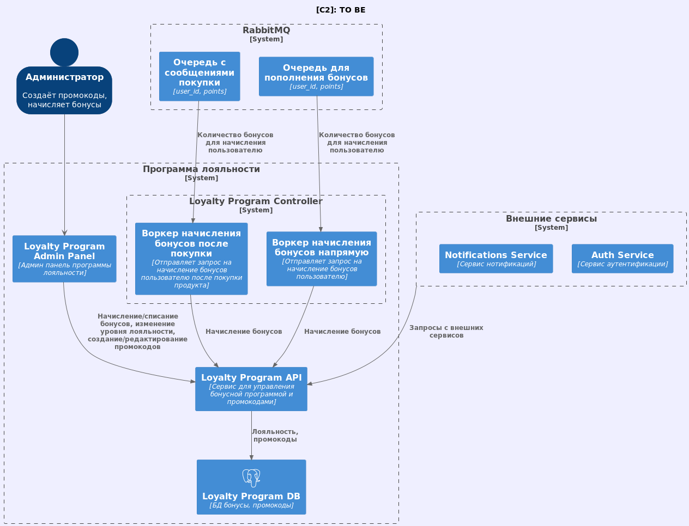

# Movies Loyalty Program
Программа лояльности для онлайн кинотеатра с промокодами и бонусным счетом

## Contributors

- Vladimir Nikishov - T1rax - @nikishov.va
- Victoria Axentii - wiky-avis - @wikyavis
- Oleg Podryadov - opodryadov - @oleg_podryadov

# Основные компоненты
## loyalty_api
Входной компонент системы. Принимает в себя сообщения для отправки и обрабатывает их.
Есть 2 основных блока бизнес логики:
- Промокоды - весь CRUD связанный с работой промиков, есть сложное применение промика с валидацией. Пользователи: Админы, сервис покупки и фронт.
- Карта лояльности с баллами - умеет создавать карту лояльности, пополнять и списывать бонусы и давать информацию по счету. Пользователи: Админы, сервис покупки, воркеры и фронт.

Почти все ручки существуют в 2 вариантах:
- api/v1 - ручки для фронта и других сервисов, нужен токен пользователя - из него читается user_id.
- api/srv - для админки и воркеров, нужен сервисный токен и user_id передается в параметрах.

## loyalty_admin
На схеме существует, но не в этой ревизии. Пока ограничиваемся дизайном для презентации, умеет дергать все srv ручки.

## loyalty_controller
Воркеры для работы с апишкой лояльности.
Сейчас есть 2 воркера:
1. calculation_of_points - слушает события покупки, считает кешбек и спавнит событие пополнения счета лояльности
2. deposit_points - слушает события пополнения карты лояльности и пополняет его.

# Как запустить проект
- В корневой папке проекта нужно создать .env файл. Наполняется содержимым файлов .env.example из всех основных компонентов (перечислены выше)
- Запускаем команду `make up-local` или `make up-local-d` для detach режима

# Дополнительная Информация
Адинка пока висит как ПР, но вмердживать не будем, она пока только для презентации

# Схемы в C4 нотации
Их можно найти в папке docs.
## C1

## C2

